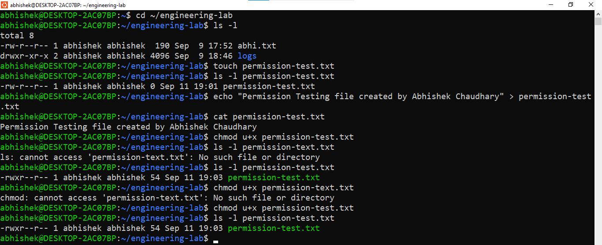
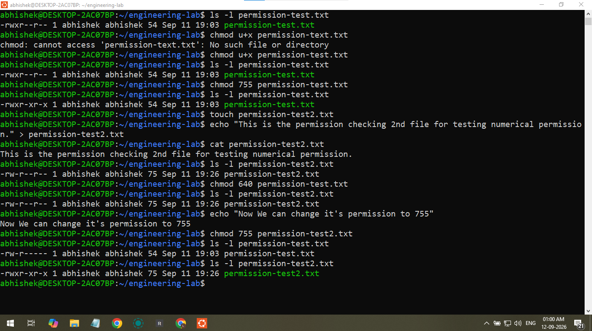

# 💻 Day 4 — Linux Permissions & `chmod`

**Phase 0 → Linux Basics**

Day 4 focused on understanding Linux file permissions and using `chmod` to modify them.

The goal was to understand **who can read, write, or execute a file** and how Linux represents these permissions.

---

## 🎯 Goals

- Understand Linux file permissions.
- Learn `r`, `w`, and `x`.
- Understand owner, group, and others.
- Use `ls -l` to inspect permissions.
- Learn `chmod`.
- Practice symbolic permissions such as `u+x`.
- Understand numeric permissions such as `755` and `640`.
- Practice changing file permissions.

---

## 🖥️ Environment

- **OS:** Windows 10
- **Linux Environment:** WSL 2
- **Distribution:** Ubuntu
- **Working Directory:** `/home/abhishek/engineering-lab`

---

# 🔍 1. Viewing File Permissions

Used:

```bash
cd ~/engineering-lab
ls -l
```

Example permission format:

```text
-rw-r--r--
```

The permission section can be understood as:

```text
-rw-r--r--
    │ │ │
    │ │ └── others
    │ └──── group
    └────── owner
```

The three basic permission types are:

```text
r = read
w = write
x = execute
```

For example:

```text
rw- → owner
r-- → group
r-- → others
```

This means the owner has read and write permissions, while group and others have read permission.

---

# 🧠 2. Understanding `r`, `w`, `x`

Linux uses three basic permissions:

| Permission | Meaning |
|---|---|
| `r` | Read |
| `w` | Write |
| `x` | Execute |

These permissions are applied to:

```text
Owner
Group
Others
```

This creates the basic Linux permission model:

```text
Owner  → rwx
Group  → rwx
Others → rwx
```

The actual permissions can differ for each group.

---

# 🧪 3. Permission Observation Lab

Created a test file:

```bash
touch permission-test.txt
```

Checked its permissions:

```bash
ls -l permission-test.txt
```

Added content:

```bash
echo "Permission testing" > permission-test.txt
```

Verified the content:

```bash
cat permission-test.txt
```

---

# 🔐 4. `chmod`

`chmod` means **change mode**.

It is used to change the permissions of files and directories.

Example:

```bash
chmod u+x permission-test.txt
```

Here:

```text
u → user/owner
+ → add permission
x → execute
```

After changing the permission, it was verified using:

```bash
ls -l permission-test.txt
```

The owner execute permission was added.

For example:

```text
Before:
-rw-r--r--

After:
-rwxr--r--
```

---

# 🔢 5. Numeric Permissions

Linux permissions can also be represented using numbers.

The basic values are:

```text
r = 4
w = 2
x = 1
```

Therefore:

```text
rwx = 4 + 2 + 1 = 7
rw- = 4 + 2     = 6
r-x = 4 + 1     = 5
r-- = 4
```

Each digit represents permissions for:

```text
Owner | Group | Others
```

For example:

```bash
chmod 755 permission-test.txt
```

means:

```text
7 → owner  → rwx
5 → group  → r-x
5 → others → r-x
```

Mental model:

```text
755
│││
││└── Others
│└─── Group
└──── Owner
```

---

# 🧪 6. Final Challenge

Created a private engineering note:

```bash
touch secure.txt
```

Added content:

```bash
echo "This is my private engineering note." > secure.txt
```

Checked the initial permissions:

```bash
ls -l secure.txt
```

Added execute permission for the owner:

```bash
chmod u+x secure.txt
```

Verified the change:

```bash
ls -l secure.txt
```

Finally, applied numeric permissions:

```bash
chmod 640 secure.txt
```

Verified again:

```bash
ls -l secure.txt
```

The final permission structure was:

```text
640
│││
││└── Others  → ---
│└─── Group   → r--
└──── Owner   → rw-
```

---

# 📸 Terminal Evidence

The following screenshots show the practical Linux exercises completed during Day 4.

### Terminal Practice — 1



### Terminal Practice — 2



---


# ⚠️ Important Lesson

During this lesson, the focus was on **understanding permissions**, not blindly applying permissions.

Commands such as:

```bash
chmod 777
```

were intentionally avoided.

Understanding what a permission means is more important than memorizing commands.

---

# 🧠 Key Mental Model

```text
r → Read
w → Write
x → Execute

u → User/Owner
g → Group
o → Others

chmod → Change permissions
ls -l → View permissions
```

Numeric model:

```text
r = 4
w = 2
x = 1
```

Therefore:

```text
7 = rwx
6 = rw-
5 = r-x
4 = r--
```

---

# 🛠️ Commands Practiced

| Command | Purpose |
|---|---|
| `ls -l` | View file permissions |
| `touch` | Create a file |
| `echo` | Write text |
| `cat` | Read file content |
| `chmod` | Change permissions |
| `chmod u+x` | Add execute permission for owner |
| `chmod 755` | Set numeric permissions |
| `chmod 640` | Set numeric permissions |

---

# 🚀 Engineering Takeaway

Linux permissions are a fundamental part of working with Linux systems.

Understanding permissions becomes important when working with:

- Servers
- System files
- Scripts
- Applications
- Deployment environments
- Containers
- Cloud infrastructure
- Security

The key idea is:

> **Linux does not just care about what a file is; it also cares about who is allowed to interact with it and how.**

---

# ✅ Day 4 Completion

- [x] `ls -l` used to inspect permissions
- [x] `r`, `w`, `x` understood
- [x] Owner, group, and others understood
- [x] `chmod` understood
- [x] `chmod u+x` practiced
- [x] Numeric permissions understood
- [x] `chmod 755` understood
- [x] `chmod 640` practiced
- [x] Final permission challenge completed

**Day 4 Status: ✅ COMPLETE**

---

## 📌 Next

**Day 5 → Next Linux skill from Phase 0**

The learning sequence will continue one focused skill at a time with practical terminal work.
